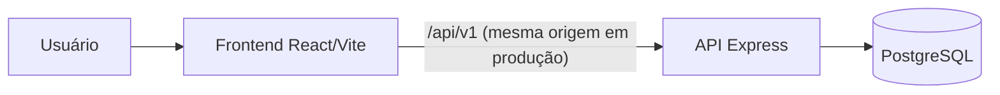

# 📈 Diário de Operações — mini índice

Diário de day trade para WIN (mini índice) e WDO (mini dólar): registre suas operações,
acompanhe curva de capital, resultado por dia/semana/mês, taxa de acerto e fator de lucro —
tudo persistido em banco, com login próprio para cada usuário.


**🔗 Acesse:** [ecx-planilha-production.up.railway.app](https://ecx-planilha-production.up.railway.app)

---

## Sumário

- [Visão geral](#visão-geral)
- [Funcionalidades](#funcionalidades)
- [Stack](#stack)
- [Arquitetura](#arquitetura)
- [Estrutura do projeto](#estrutura-do-projeto)
- [Como rodar localmente](#como-rodar-localmente)
- [Variáveis de ambiente](#variáveis-de-ambiente)
- [API](#api)
- [Deploy](#deploy)
- [Troubleshooting](#troubleshooting)

---

## Visão geral

Cada fechamento diário lançado (data + resultado em pontos do mini índice) é convertido
automaticamente em resultado financeiro, com base no valor do ponto do WIN (R$0,20/pt).
A partir desses lançamentos diários o painel monta:

- Curva de capital acumulada
- Resultado semanal, mensal e anual (barra + linha de acumulado)
- Distribuição de dias positivos x negativos
- Ganho x perda total
- Cartões de resumo: pontos e resultado do dia, semana, mês, ano, assertividade, dias
  positivos/negativos, fator de lucro

Cada usuário só vê e edita seus próprios fechamentos. O layout segue a paleta cinza-escuro,
roxo e branco definida no protótipo original do projeto.

## Funcionalidades

- 🔐 Cadastro e login com JWT — cada conta é isolada
- ✍️ Tabela de fechamentos editável em linha (data, pontos e financeiro), com salvamento
  automático (cria/atualiza/remove no banco conforme você edita, sem botão de "salvar") — permite
  mais de um lançamento na mesma data
- 🧮 Resultado financeiro calculado automaticamente a partir dos pontos (mini índice, R$0,20/pt)
- 🐷 Capital inicial configurável, somado ao resultado acumulado para exibir o capital atual
  (inclusive na curva de capital)
- 🔄 Botão **Exemplo** — popula o diário com 12 fechamentos de demonstração
- 🗑️ Botão **Limpar** — remove todos os seus fechamentos de uma vez
- 📊 5 gráficos (Recharts): curva de capital, semanal, mensal, pizza de dias positivos x
  negativos, pizza de ganho/perda

## Stack

| Camada | Tecnologias |
|---|---|
| Frontend | React 19, Vite, React Router, Axios, Tailwind CSS v4, Recharts, lucide-react |
| Backend | Node.js, Express 5, Sequelize, JWT, bcryptjs, Helmet, rate limiting |
| Banco | PostgreSQL |
| Deploy | Docker (multi-stage) na Railway — backend serve o build estático do frontend |

Projeto construído espelhando a stack e as convenções do **Projeto-Delivery** (mesma
estrutura `BackEnd/` + `frontend/`, padrão de `.env`, controllers/routes/models Sequelize).

## Arquitetura



Em produção, o Express do backend serve tanto a API (`/api/v1/*`) quanto os arquivos
estáticos do build do frontend — um único serviço, sem CORS entre eles. Em desenvolvimento,
o Vite roda separado na porta 5173 e faz proxy de `/api` para o backend na 3001.

## Estrutura do projeto

```text
Ecx-Planilha/
├─ Dockerfile                 # build multi-stage (frontend + backend) usado no deploy
├─ BackEnd/
│  └─ src/
│     ├─ app.js                # Express app: middlewares, rotas, static em produção
│     ├─ config/db.js          # instância Sequelize (suporta DATABASE_URL ou vars soltas)
│     ├─ controllers/          # userController, dailyResultController, middleware/auth
│     ├─ database/             # config do sequelize-cli + migrations
│     ├─ middleware/           # rate limiter
│     ├─ models/                # User, DailyResult
│     └─ routes/                # userRoutes, dailyResultRoutes
└─ frontend/
   └─ src/
      ├─ pages/                 # Login, Register, Diario (o painel principal)
      ├─ services/api.js        # instância Axios com interceptors de auth
      └─ theme.js                # paleta de cores compartilhada
```

## Como rodar localmente

### Pré-requisitos
- Node.js 18+
- PostgreSQL em execução

### 1. Banco de dados
```bash
createdb -U postgres diario_operacoes
```

### 2. Backend
```bash
cd BackEnd
copy .env.example .env
# edite BackEnd/.env com usuário/senha do seu Postgres e um JWT_SECRET forte
npm install
npm run db:migrate
```

### 3. Frontend
```bash
cd frontend
copy .env.example .env
npm install
```

### 4. Subir tudo junto
Na raiz do projeto:
```bash
npm install
npm run dev
```
Backend em `http://localhost:3001`, frontend em `http://localhost:5173` (com proxy de
`/api` para o backend — não precisa configurar CORS para dev local).

Crie uma conta em `/register`, faça login e comece a lançar seus fechamentos diários.
**Exemplo** carrega dados de demonstração; **Limpar** apaga todos os seus fechamentos.

## Variáveis de ambiente

### `BackEnd/.env`
| Variável | Padrão (dev) | Descrição |
|---|---|---|
| `DB_HOST`, `DB_PORT`, `DB_NAME`, `DB_USER`, `DB_PASS` | `localhost:5432/diario_operacoes` | Conexão Postgres (ignoradas se `DATABASE_URL` estiver definida) |
| `DATABASE_URL` | — | Usada automaticamente em produção (ex: Railway) |
| `PORT` | `3001` | Porta do servidor |
| `JWT_SECRET` | — | Chave de assinatura dos tokens — **obrigatória, use um valor forte** |
| `JWT_EXPIRES_IN` | `7d` | Validade do token / cookie de sessão |
| `CORS_ALLOWED_ORIGINS` | `http://localhost:5173` | Origens permitidas (não usado em produção, já que é mesma origem) |
| `RESEND_API_KEY` | — | Chave de API do [Resend](https://resend.com/api-keys), usada para enviar o e-mail de redefinição de senha. Sem ela, o link só aparece no log do servidor (modo dev) |
| `RESEND_FROM_EMAIL` | `onboarding@resend.dev` | Remetente do e-mail — o padrão de teste do Resend só entrega para o e-mail da própria conta; verifique um domínio em resend.com/domains para enviar a qualquer destinatário |

### `frontend/.env`
| Variável | Padrão | Descrição |
|---|---|---|
| `VITE_API_URL` | *(vazio → usa caminho relativo `/api/v1`)* | Só necessário se o frontend for servido separado do backend |

## API

Prefixo: `/api/v1`. A sessão é um JWT em cookie `httpOnly` (setado no login/registro); rotas de
`daily-results` e `/users/me` exigem esse cookie (ou, como alternativa para chamadas diretas de
API, um header `Authorization: Bearer <token>`).

| Método | Rota | Descrição |
|---|---|---|
| POST | `/users/register` | Cria conta, retorna `{ user }` e seta o cookie de sessão |
| POST | `/users/login` | Autentica, retorna `{ user }` e seta o cookie de sessão |
| POST | `/users/logout` | Limpa o cookie de sessão |
| POST | `/users/forgot-password` | Envia (por e-mail) um link de redefinição de senha, se o e-mail existir — sempre responde com a mesma mensagem genérica |
| POST | `/users/reset-password` | Troca a senha usando o token recebido por e-mail (válido por 1h, uso único) |
| GET | `/users/me` | Perfil do usuário autenticado |
| PUT | `/users/me` | Atualiza o nome e/ou o capital inicial do usuário |
| GET | `/daily-results` | Lista os fechamentos diários do usuário |
| POST | `/daily-results` | Cria um fechamento diário (permite mais de um por data) |
| PUT | `/daily-results/:id` | Atualiza um fechamento |
| DELETE | `/daily-results/:id` | Remove um fechamento |
| POST | `/daily-results/seed` | Substitui os fechamentos pelo conjunto de exemplo |
| DELETE | `/daily-results` | Remove todos os fechamentos do usuário |
| GET | `/health/db` | Healthcheck da conexão com o banco |

## Deploy

Hospedado na **Railway**: um serviço Node (build via `Dockerfile` na raiz) + um serviço
PostgreSQL, no mesmo projeto.

```bash
railway login
railway link                 # conecta esta pasta ao projeto
railway variables --set 'DATABASE_URL=${{Postgres.DATABASE_URL}}' --service <nome-do-servico>
railway variables --set 'JWT_SECRET=<chave-forte>' --service <nome-do-servico>
railway variables --set 'NODE_ENV=production' --service <nome-do-servico>
```

O `Dockerfile` builda o frontend, copia o `dist/` para dentro da imagem do backend e, ao
subir o container, roda as migrations pendentes (`npx sequelize db:migrate`) antes de
iniciar o servidor. Gere o domínio público em **Settings → Networking → Generate Domain**
no serviço do backend.

## Troubleshooting

**"Application failed to respond" (502) na Railway**
Geralmente é `DATABASE_URL` ausente/não vinculada ao serviço do Postgres, ou o container
saindo em loop por falha na migration. Veja os logs com `railway logs --service <nome>`.

**CORS bloqueado em desenvolvimento**
Confirme que o frontend está rodando em uma porta listada em `CORS_ALLOWED_ORIGINS` no
`BackEnd/.env` — ou simplesmente acesse pela porta que o `npm run dev` imprimir.

**Erro de conexão com o Postgres local**
Verifique se o serviço está rodando e se `DB_USER`/`DB_PASS`/`DB_NAME` no `BackEnd/.env`
batem com o seu Postgres local.
